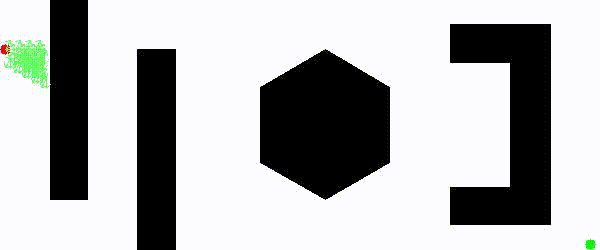
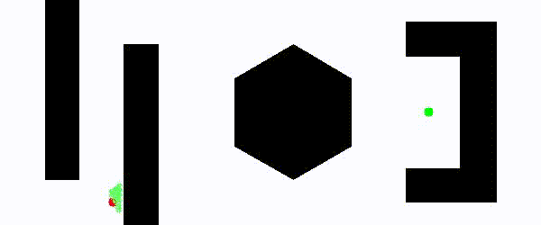

# a-start-path-planner

## Dependencies

- Python 3.6 or higher
- Numpy
- OpenCV 3.4.2 or higher
- time

## Running

```bash
python3 a_star_kshitij_abhishek.py
```

The user will be asked to input the start and goal coordinates of the robot. See example below

```bash
Enter x coordinate of start point: 1180
Enter y coordinate of start point: 250
Enter x coordinate of goal point: 950
Enter y coordinate of goal point: 250
Enter the clearnance of the robot: 2
Enter the radius of the robot: 2
Enter the step size: 1
```

The code will generate a visualization of the path planning process and the final path. The visualization will be saved as a video in the current directory along with the final path as an image.

## Example Test Cases

The following test cases have been provided for you.

### Test Case 1

```txt
Starting Coordinates = 10, 400, 0

Goal Coordinates = 1180, 10, 30

Clearance = 2

Radius = 2

Step Size = 10
```

Time Taken: 512 seconds



### Test Case 2

```txt
Starting Coordinates = 250, 50, 30

Goal Coordinates = 950, 250, 60

Clearance = 2

Radius = 2

Step Size = 5
```

Time Taken: 240 seconds



### Test Case 3

```txt
Starting Coordinates = 1180, 250, 0

Goal Coordinates = 950, 250, 180

Clearance = 2

Radius = 2

Step Size = 1
```

Time Taken: 13 seconds


